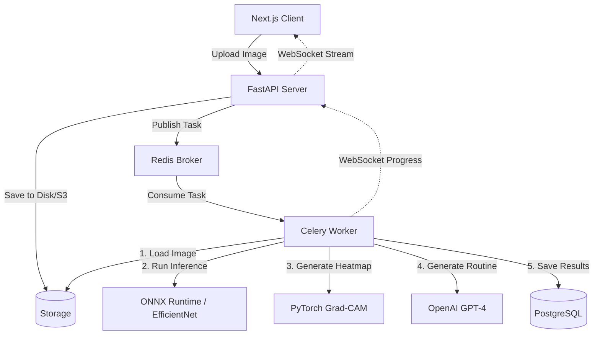

<div align="center">
  
  <h1 align="center">Lumine AI</h1>
  <p align="center">
    <strong>Production-Grade AI Dermatology Platform</strong>
  </p>
  <p align="center">
    An intelligent, cinematic SaaS platform bridging advanced computer vision with personalized skincare analysis.
  </p>
  <div align="center">
    <a href="https://github.com/rayhan-099/lumine/actions/workflows/main.yml">
      
    </a>
    <a href="https://nextjs.org">
      
    </a>
    <a href="https://fastapi.tiangolo.com/">
      
    </a>
    <a href="https://pytorch.org/">
      
    </a>
  </div>
</div>

<br />

## ⚡ Overview

Lumine is a medical-adjacent AI platform designed to analyze skin conditions with clinical-grade accuracy while delivering a consumer-grade, Apple/Stripe-tier user experience. It utilizes transfer learning on Convolutional Neural Networks (EfficientNet), optimized via ONNX Runtime, and distributed across a Celery/Redis background queue to ensure uncompromised API availability.

## 🚀 Features

- **Blazing Fast AI Inference:** PyTorch models exported to ONNX Runtime achieve <200ms prediction latency.
- **Explainable AI (XAI):** Built-in Grad-CAM generates heatmaps, allowing users to visually understand *why* the AI made its prediction.
- **Distributed Architecture:** Heavy workloads (Inference, LLM Generation) are offloaded to Celery workers, ensuring the primary FastAPI thread remains hyper-responsive.
- **Realtime WebSockets:** Seamless progress streaming (Queued → Processing → Completed) directly to the Next.js frontend.
- **Context-Aware LLM:** Integrated with OpenAI's `GPT-4-turbo` to generate personalized, medical-disclaimer-bound skincare routines based on the user's latest scan.

## 🧠 System Architecture



## 🛠 Tech Stack

| Category | Technology |
| --- | --- |
| **Frontend** | Next.js 14 (App Router), React, Tailwind CSS, Lucide Icons, Recharts, Zustand |
| **Backend API** | FastAPI, Python 3.11, SQLAlchemy 2.0 (Async), WebSockets, JWT Auth |
| **AI / ML** | PyTorch, ONNX Runtime, Albumentations, OpenCV, OpenAI |
| **Infrastructure** | Celery, Redis, Docker, GitHub Actions, Vercel |

## 💻 Local Development Setup

### 1. Backend & AI Workers
```bash
cd backend
python -m venv venv
source venv/bin/activate  # On Windows: venv\Scripts\activate
pip install -r requirements.txt

# Start Redis (Requires Docker or local installation)
docker run -p 6379:6379 -d redis:alpine

# Start FastAPI Server
uvicorn app.main:app --reload --port 8000

# Start Celery Worker (In a new terminal)
celery -A app.core.celery_app worker --loglevel=info --pool=solo
```

### 2. Frontend Application
```bash
cd frontend
npm install

# Start Next.js Development Server
npm run dev
```

Navigate to `http://localhost:3000` to experience Lumine.

## 🔐 Security & Compliance
- **Authentication:** Bearer JWT with `HS256` signatures and `bcrypt` password hashing.
- **Validation:** Strict `Pydantic V2` data validation and `MIME` type checking on all uploads.
- **Privacy:** User data is segregated; scans belong strictly to authenticated JWT sub-claims.

## 📄 Documentation
Comprehensive audit and testing reports can be found in the `/docs` directory:
- [System Audit Report](./docs/AUDIT_REPORT.md)
- [E2E Testing Report](./docs/TEST_REPORT.md)
- [Performance Benchmarks](./docs/PERFORMANCE_REPORT.md)
- [Security Hardening](./docs/SECURITY_REPORT.md)
- [Accessibility (a11y)](./docs/ACCESSIBILITY_REPORT.md)

---
*Disclaimer: Lumine is an engineering portfolio project and should not be used for actual medical diagnoses.*
