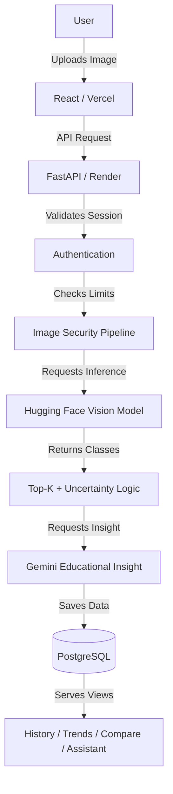

<div align="center">
  <h1>LUMINE AI</h1>
  <p><strong>AI-Powered Skin Intelligence</strong></p>
  <p>A full-stack platform combining computer vision, longitudinal skin-analysis history, uncertainty-aware ML inference, and generative AI explanations.</p>
  
  <a href="https://lumineai.vercel.app/" target="_blank"><strong>LIVE DEMO</strong></a> |
  <a href="https://lumine-eblk.onrender.com/docs" target="_blank"><strong>API</strong></a> |
  <a href="https://github.com/Rayhan-099/lumine" target="_blank"><strong>REPOSITORY</strong></a>
  
  <br />
  <br />

  
  
  
  
  
  
  
  
</div>

---

## 📸 Product Showcase

*(Screenshots to be added manually)*

| Home | Analysis |
| :---: | :---: |
| `docs/images/lumine-home.webp` | `docs/images/lumine-analysis.webp` |

| Dashboard | History |
| :---: | :---: |
| `docs/images/lumine-dashboard.webp` | `docs/images/lumine-history.webp` |

| Trends | Assistant |
| :---: | :---: |
| `docs/images/lumine-trends.webp` | `docs/images/lumine-assistant.webp` |

---

## 📖 What is Lumine AI?

Lumine AI is an educational platform that allows users to:
- Upload skin images for analysis
- Receive AI visual classifications
- Inspect classification scores and Top-3 model predictions
- Receive uncertainty warnings
- Read educational AI-generated explanations via Gemini
- Create and manage user accounts
- Maintain their analysis history and observe longitudinal trends
- Compare previous analyses side-by-side
- Ask contextual questions through the personalized Lumine AI Assistant
- Completely control and delete stored analysis data

Anonymous demo scans are supported but not persisted in the database.

---

## ✨ Key Features

**AI Vision**
- DINOv2-based skin classification
- 31 supported visual classes
- Top-3 predictions and classification scores
- Ambiguity detection and safe inference failure states

**Generative Intelligence**
- Gemini-generated educational explanations
- Contextual, history-aware insights from the Lumine Assistant
- Transient retry/fallback handling for API stability

**Personalization**
- Secure accounts and individual scan history
- Longitudinal Trends and side-by-side Compare
- Personalized Assistant context

**Privacy**
- Individual analysis deletion
- Clear history controls
- Anonymous scans are never persisted
- Transparent provenance tracking

**Security**
- JWT authentication and secure password hashing
- Request rate limiting
- File upload byte limits (10 MB)
- Decoded-image memory limits (20 MP)
- Strict CORS restrictions and security headers
- Robust secret validation on startup

---

## ⚙️ How it Works


```mermaid
graph TD;
    User-->|Uploads Image| React[React / Vercel]
    React-->|API Request| FastAPI[FastAPI / Render]
    FastAPI-->|Validates Session| Auth[Authentication]
    Auth-->|Checks Limits| ImageSec[Image Security Pipeline]
    ImageSec-->|Requests Inference| HF[Hugging Face Vision Model]
    HF-->|Returns Classes| Logic[Top-K + Uncertainty Logic]
    Logic-->|Requests Insight| Gemini[Gemini Educational Insight]
    Gemini-->|Saves Data| DB[(PostgreSQL)]
    DB-->|Serves Views| Views[History / Trends / Compare / Assistant]
```

---

## 🧠 ML Pipeline

The current core vision model is: `Jayanth2002/dinov2-base-finetuned-SkinDisease`

This model is a **DINOv2-based classifier** trained on 31 distinct visual classes. For each image, the pipeline extracts the **Top-3 predictions**, their corresponding **classification scores**, and applies an **ambiguity heuristic** to warn users when confidence is low.

> [!WARNING]
> **IMPORTANT LIMITATION:** The current model is closed-set. It does **NOT** contain a "Normal" or "Healthy" class. As a result, it may assign one of its known disease classes to normal healthy skin or out-of-domain images (e.g. objects). Classification scores are **NOT** diagnostic probabilities.

Future work may include implementing normal/abnormal screening, out-of-distribution rejection, and broader dermatological coverage.

---

## 💻 Tech Stack

| Component | Technologies |
| --- | --- |
| **Frontend** | React, JavaScript, CSS (Vanilla styling) |
| **Backend** | FastAPI, Python, Uvicorn, Gunicorn |
| **AI** | Hugging Face InferenceClient, Google Gemini 2.5 Flash |
| **Database** | PostgreSQL, SQLAlchemy, Alembic |
| **Security** | JWT (python-jose), Passlib (bcrypt), SlowAPI, CORS, Headers |
| **Deployment** | Vercel (Frontend), Render (Backend) |
| **Testing** | Pytest |

---

## 📂 Architecture

- **`app/`**: Core backend logic
  - **`api/`**: RESTful routing and endpoint definitions
  - **`core/`**: Configuration, logging, rate limiting, and security settings
  - **`models/`**: SQLAlchemy database models
  - **`schemas/`**: Pydantic validation schemas
  - **`services/`**: ML inference (HF) and LLM (Gemini) integration logic
- **`src/`**: React frontend source code
  - **`components/`**: UI components and views
- **`alembic/`**: Database migration scripts
- **`tests/`**: Pytest backend testing suite

---

## 🔌 API Overview

Lumine's REST API is structured into these primary endpoints:

- **Authentication**: User registration, login, and token generation
- **Analysis**: Image upload, validation, inference, and Gemini insight generation
- **History**: Fetching paginated user analysis records
- **Trends**: Longitudinal symptom and classification tracking
- **Compare**: Side-by-side analysis diffing
- **Assistant**: Context-aware RAG querying over user history
- **Privacy**: Fine-grained data deletion and account wiping
- **Health**: `GET /health` monitoring endpoint

---

## 🔒 Security & Privacy

Lumine implements several crucial controls factually:
- JWT authentication with securely validated `SECRET_KEY` requirements
- Secure password hashing using bcrypt
- Upload validations limiting files to 10 MB and decompressed pixels to 20 MP to prevent memory-exhaustion (OOM) attacks
- Strict CORS allowlisting and HTTP security headers
- In-memory rate limiting preventing abuse (`DictStorage`, local to instance)
- Anonymous analysis non-persistence
- User-scoped authorization for all history and deletion controls

---

## 🛠️ Local Development

1. **Clone the repository**
   ```bash
   git clone https://github.com/Rayhan-099/lumine.git
   cd lumine
   ```

2. **Backend Setup**
   ```bash
   python -m venv venv
   source venv/bin/activate  # On Windows: venv\Scripts\activate
   pip install -r requirements.txt
   ```

3. **Configure Environment**
   Copy `.env.example` to `.env` and fill in the required keys.

4. **Initialize Database**
   ```bash
   alembic upgrade head
   ```

5. **Start FastAPI**
   ```bash
   uvicorn app.main:app --reload
   ```

6. **Frontend Setup**
   ```bash
   npm install
   npm start
   ```

---

## 🔑 Environment Variables

**Backend Variables (`.env`)**:
- `SECRET_KEY` (Required)
- `GEMINI_API_KEY` (Required)
- `HF_TOKEN` (Required)
- `DATABASE_URL` (Required)
- `CORS_ORIGINS` (Optional)
- `GEMINI_MODEL` (Optional, Default: gemini-2.5-flash)
- `HF_IMAGE_MODEL` (Optional, Default: Jayanth2002/dinov2-base-finetuned-SkinDisease)

*Note: Any frontend `REACT_APP_*` variable is public and must never contain secrets.*

---

## 🚀 Deployment

- **Frontend**: Deployed via **Vercel** (`npm run build`).
- **Backend**: Hosted on **Render** utilizing `uvicorn`.
- **Database**: Managed **PostgreSQL** instance.

The backend health can be monitored via the `GET /health` endpoint.

---

## 🧪 Testing

Lumine maintains a backend test suite using `pytest`.

```bash
# Run the backend test suite
python -m pytest tests/
```

Currently, **39 tests pass** ensuring core auth, database integrity, LLM fallback, image security constraints, and privacy endpoints remain stable.

---

## 📜 Limitations

> [!CAUTION]
> - Lumine AI is an **informational and educational system only**. It is **not** a tool for medical diagnosis.
> - The current classifier supports 31 closed-set visual classes and has **no explicit Normal/Healthy class**.
> - Classification scores are not disease probabilities.
> - Image-only analysis cannot replace clinical examination.
> - Model performance may vary by image quality, lighting, skin tone, presentation, and conditions outside the training distribution.
> - External AI services (Hugging Face, Gemini) may occasionally be unavailable or rate-limited.

---

## 🗺️ Roadmap

- [x] Full-stack deployment
- [x] JWT authentication
- [x] PostgreSQL persistence
- [x] Real Hugging Face inference
- [x] Gemini integration
- [x] Analysis history, Trends, Compare, Assistant
- [x] Privacy deletion and Provenance tracking
- [x] Security hardening (Rate limiting, Image Bombs)
- [ ] Normal-vs-abnormal screening
- [ ] Out-of-distribution rejection
- [ ] Broader dermatology model coverage
- [ ] Formal ML benchmark/evaluation
- [ ] Expanded automated security testing

---

## 👨‍💻 Author

**Rayhan**
